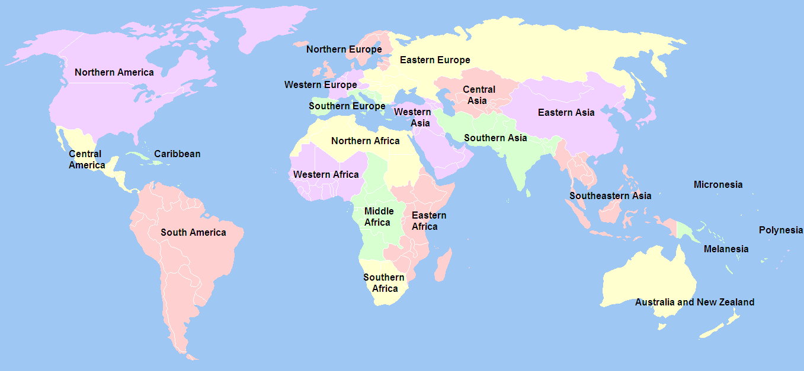
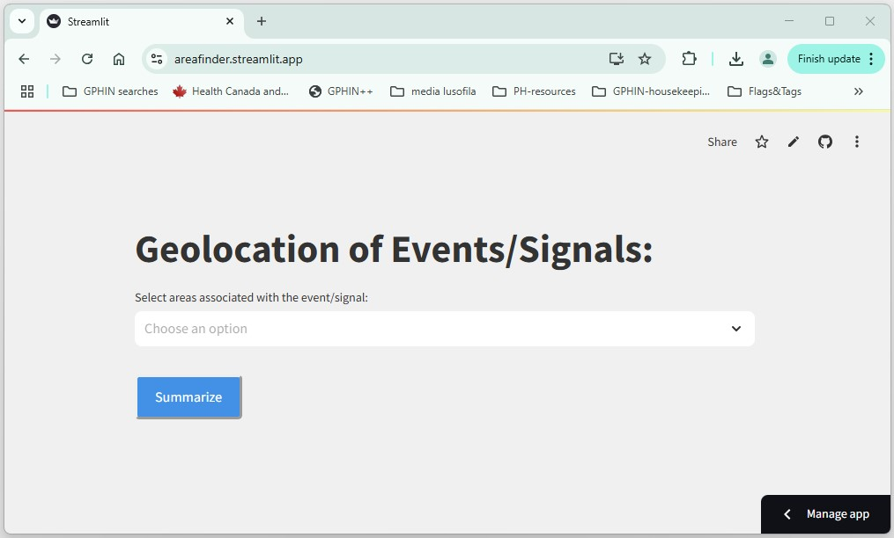
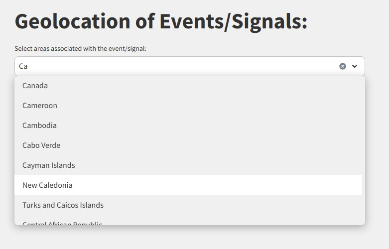
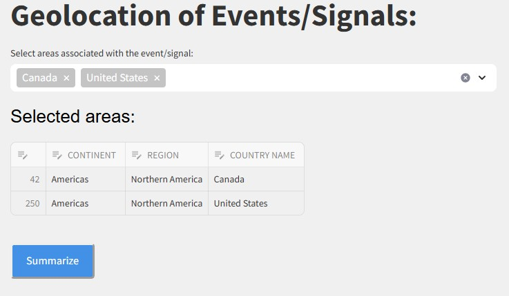
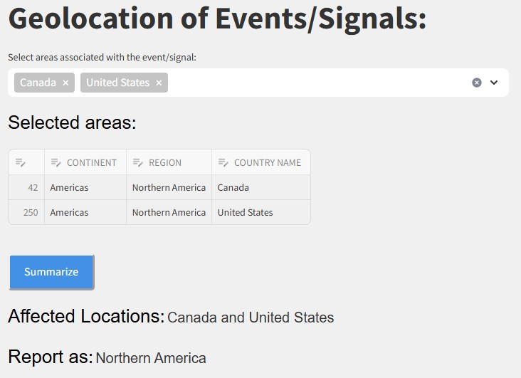

# How-To Guide to geographical location using [AreaFinder](https://areafinder.streamlit.app/)

## Purpose
This How-To Guide provides clear, step-by-step instructions on how to effectively use the AreaFinder app and follow GPHIN's guidelines for geographical location of epidemiological events in GPHIN products. The objective is to apply standardized name when reporting on events in GPHIN products, particularly the Daily Report. The guide is designed to ensure consistency, accuracy, and alignment with official [Government of Canada](https://www.canada.ca/en/government/system/digital-government/digital-government-innovations/enabling-interoperability/gc-enterprise-data-reference-standards/current-past-official-names-countries-territories-geographic-areas.html) and United Nations geolocation standards ([M49](https://unstats.un.org/unsd/methodology/m49/)), enabling the smooth implementation of automated workflows in the GPHIN Collaboration Hub.

---

## Scope
### This guide covers the following tasks:
 - The step-by-step process of applying the geolocation standards outlined in the Daily Report.
 - Guidance on ensuring that country names, regional classifications, and geolocation attributes adhere to the official GoC and UN M49 standards.
 - How to use the AreaFinder app to select the appropriate geographical location (continent, region, or country) when describing events to GPHIN products.

### Audience
This guide is intended for GPHIN analysts and epidemiologists.

---

## General Guidelines

### 1. Country and Territory Names
 - The names of countries and territories mentioned in **Daily Report** entries will follow the spelling (including accents) as recognized by the [Government of Canada](https://www.canada.ca/en/government/system/digital-government/digital-government-innovations/enabling-interoperability/gc-enterprise-data-reference-standards/current-past-official-names-countries-territories-geographic-areas.html).

   - **Example:** Consider the following event from the **Daily Report** dated January 16, 2025:

According to the Government of Canada, the country name should be written as **`Türkiye`**:

### 2. Attribution for Multiple Countries or Territories
 - For entries involving multiple countries or territories, the attribution will follow the [United Nations geoscheme M49](https://en.wikipedia.org/wiki/United_Nations_geoscheme) regions, or continents where applicable. If neither is possible, the entry will be attributed to **`Multiregional`** or **`Worldwide`** based on the following rules:

- #### 3a. **Single Region**: If all affected locations are within one region, the name of that region will be assigned.  
   - **Example:** If the affected locations are Costa Rica and Panama, the event is assigned to **`Central America`**.

- #### 3b. **Single Continent, Multiple Regions**: If affected locations span multiple regions within a single continent, the continent's name will be assigned.  
   - **Example:** If the affected locations are Czechia, Germany, and Spain, the event is assigned to **`Europe`**.

- #### 3c. **Multiregional**: If affected locations include two or more regions from different continents, the event will be considered `Multiregional`.  
   - **Example:** If the affected locations are Morocco and Spain, the event is assigned to **`Multiregional`**.

- #### 3d. **Worldwide**: If affected locations span all continents (excluding Antarctica), the event will be considered `Worldwide`.  
   - **Example:** If the affected locations are Canada, Iran, Mozambique, New Caledonia, and Switzerland, the event is assigned to **`Worldwide`**.

### 3. Event reported by Public Health Agencies (e.g., WHO, PAHO, CDC, ECDC, GPEI, among others)
 - Entries in the **Daily Report** will no longer be attributed to institutions but only to geolocalities.

   - **Example:** Consider the following event from the Daily Report dated January 28, 2025:

This event will be attributed to **`Americas`**, as it is the shared region for the countries listed in the summary (shown below):

---

## Using [AreaFinder](https://areafinder.streamlit.app/) to report geolocations

 - This application was created to assist the GPHIN team in verifying country and territory names according to current database standards and to help determine the appropriate level of geolocation for reporting.

- #### 1. **Open [AreaFinder](https://areafinder.streamlit.app/):**

- #### 2. **Select affected locations by typing or scrolling through the selection menu:**

- #### 3. **Once you have completed the selection, summarize the results:**

- #### 4. **The application will display the summarized information by indicating the Affected Areas and the appropriate reporting format:**

