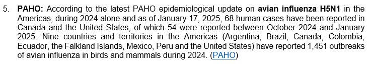
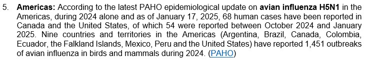

# How-To Guide to geographical location using [AreaFinder](https://areafinder.streamlit.app/)

## Purpose
This How-To Guide provides clear, step-by-step instructions on how to effectively use the AreaFinder app and follow GPHIN's guidelines for geographical location of epidemiological events in GPHIN products. The objective is to apply standardized name when reporting on events in GPHIN products, particularly the Daily Report. The guide is designed to ensure consistency, accuracy, and alignment with official [Government of Canada](https://www.canada.ca/en/government/system/digital-government/digital-government-innovations/enabling-interoperability/gc-enterprise-data-reference-standards/current-past-official-names-countries-territories-geographic-areas.html) and United Nations geolocation standards ([M49](https://unstats.un.org/unsd/methodology/m49/)), enabling the smooth implementation of automated workflows in the GPHIN Collaboration Hub.

## Scope
### This guide covers the following tasks:
 - How to use the AreaFinder app to select the appropriate geographical location (continent, region, or country) when describing events to GPHIN products.
 - The step-by-step process of applying the geolocation standards outlined in the Daily Report.
 - Guidance on ensuring that country names, regional classifications, and geolocation attributes adhere to the official GoC and UN M49 standards.

### Audience
This guide is intended for GPHIN analysts and epidemiolgists.

## General Guidelines

### 1. The names for countries and territories associated with Daily Report entries will be spelled (including accents) in accordance to the names recognized by the  [Government of Canada](https://www.canada.ca/en/government/system/digital-government/digital-government-innovations/enabling-interoperability/gc-enterprise-data-reference-standards/current-past-official-names-countries-territories-geographic-areas.html).

Consider the event below from the Daily Report of Jan. 16, 2025:

The country, according to the Canadian Government should be written as `Türkiye`:

### 2. Daily Report entries no longer will be attributed to institutions, only Geolocalities.

Consider the image below from the Daily Report of Jan. 28, 2025:

This entry would be written, under this new protocol as follows:

